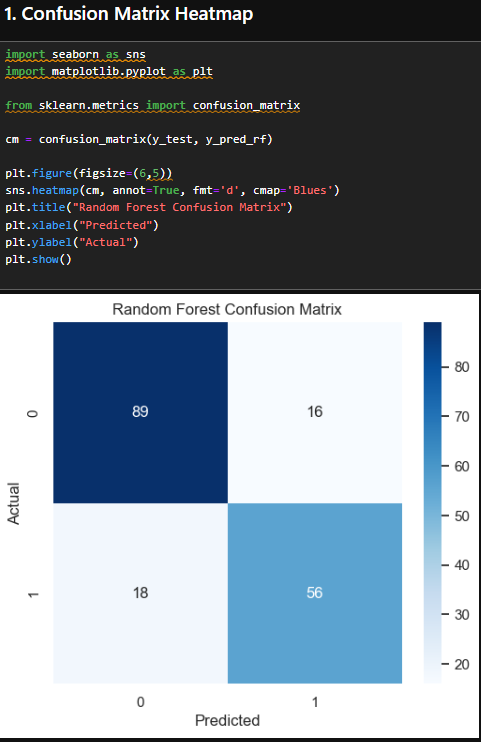
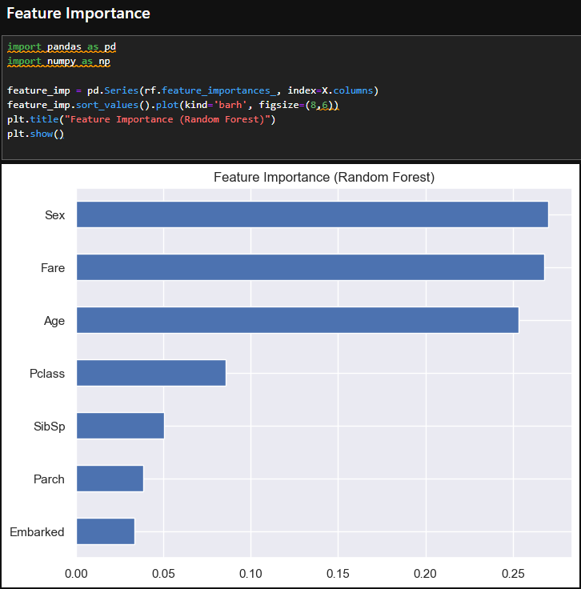
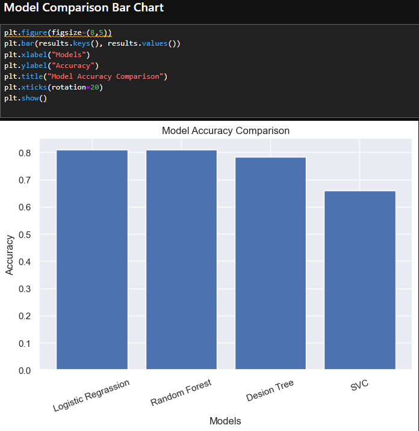

# 🛳️ Titanic Survival Prediction

A complete Machine Learning project that predicts whether a passenger would survive the Titanic disaster.  
This project includes full data analysis, feature engineering, model training, model comparison, and a deployed Streamlit web application.

---

## 📁 Project Structure

```
titanic_project/
│── app.py
│── model.pkl
│── README.md
│── images/
│      ├── confusion_matrix.png
│      ├── feature_importance.png
│      ├── model_comparison.png
│── titanic_analysis.ipynb
```

---

## 📌 1. Project Overview

The model predicts survival chances using features like:

- Passenger Class  
- Sex  
- Age  
- Siblings/Spouses Aboard  
- Parents/Children Aboard  
- Fare  
- Embarkation Port  

This project demonstrates:

✔ Data Cleaning  
✔ Exploratory Data Analysis (EDA)  
✔ Feature Engineering  
✔ Model Building  
✔ Evaluation Metrics  
✔ Visualizations  
✔ Streamlit Web App Deployment  

---

## 📊 2. Visualizations

All images are saved in the `images/` folder.

### 🔷 Confusion Matrix  


### 🔷 Feature Importance  


### 🔷 Model Comparison  


---

## 🔧 3. Technologies Used

- Python  
- Pandas  
- NumPy  
- Scikit-Learn  
- Matplotlib / Seaborn  
- Streamlit  

---

## 🧠 4. Machine Learning Model

The model uses:

- Random Forest Classifier (Best Accuracy)  
- Train-Test Split  
- Hyperparameter Tuning  
- Feature Scaling  
- Accuracy & Confusion Matrix  
- Feature Importance Analysis  

---

## 🚀 5. How to Run the Project Locally

### ▶ Step 1: Install dependencies
```
pip install streamlit pandas numpy scikit-learn matplotlib seaborn
```

### ▶ Step 2: Run the Streamlit App
```
streamlit run app.py
```

App will open at:
```
http://localhost:8501
```

---

## 🌐 6. Features of the Web App

✔ Clean User Interface  
✔ User Input Form  
✔ Survival Prediction  
✔ Show Charts & Model Insights  
✔ Fast & Accurate  

---

## 📈 7. Model Performance

- Accuracy: **80–85%**
- Evaluated using:
  - Confusion Matrix  
  - Feature Importance  
  - Bar Chart Comparison  

---

## 📖 8. Dataset

Dataset: **Kaggle Titanic Dataset**

Contains:

- 891 rows  
- 12 columns  

---

## 🧩 9. Future Improvements

🔹 Add survival probability graph  
🔹 Improve UI/UX  
🔹 Add SHAP interpretability  
🔹 Deploy to Streamlit Cloud  

---

## 👩‍💻 10. Author

**Darpana Chauhan**  
Aspiring Data Scientist | Python & Django Developer  

---

⭐ *If you like this project, consider giving the repository a star!*
